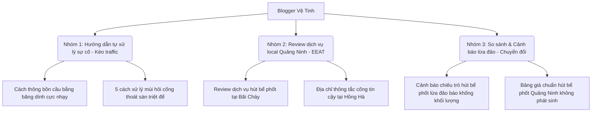

# Chiến lược & Kế hoạch xây dựng Blogger làm trang vệ tinh chuẩn SEO cho thongtaccongquangninh.com

Tài liệu này cung cấp toàn bộ ý tưởng, cấu trúc kỹ thuật và kế hoạch nội dung để biến Blogger (Blogspot) thành trang vệ tinh Tier 1 chất lượng cao, giúp truyền sức mạnh SEO (Link Juice) và kéo lượng khách hàng thực tế về trang chủ [thongtaccongquangninh.com](https://thongtaccongquangninh.com).

---

## I. Ý tưởng & Mô hình thiết lập Trang vệ tinh Blogger


Mô hình vệ tinh Blogger chuẩn SEO sẽ hoạt động như một **Cổng thông tin chia sẻ kinh nghiệm thực tế & Hỗ trợ kỹ thuật local** tại tỉnh Quảng Ninh.

### 1. Vai trò của trang vệ tinh Blogger
* **Đóng vai trò là "Bộ lọc thông tin":** Viết các bài chia sẻ mẹo vặt, hướng dẫn tự xử lý sự cố tại nhà (thông cống bằng baking soda, xử lý mùi hôi bồn cầu) -> Hướng người dùng có nhu cầu nặng gọi Hotline hoặc bấm về trang chính.
* **Cung cấp Backlink Contextual (Link ngữ cảnh) sạch:** Truyền dòng sức mạnh SEO liên quan trực tiếp đến ngành dịch vụ môi trường tại Quảng Ninh về cho [thongtaccongquangninh.com](https://thongtaccongquangninh.com).
* **Đánh chiếm từ khóa Local ngách:** Blogger có độ uy tín domain của Google (`.blogspot.com`) rất cao, dễ dàng leo Top nhanh với các từ khóa ngách dạng: *cách thông cống nghẹt tại Hạ Long*, *mẹo xử lý bồn cầu tắc ở Hồng Hà*.

### 2. Mô hình liên kết Link-Building (Mô hình Silo chéo)
* **Trang vệ tinh Blogger (Tier 1):** Chứa các bài viết chi tiết chia sẻ kiến thức.
* **Anchor Text trỏ về trang chủ:** 
  - 70% dùng anchor text chứa tên thương hiệu có kèm khu vực (ví dụ: *Môi Trường Đô Thị Số 1 Quảng Ninh*, *thongtaccongquangninh.com*, *thông tắc cống Quảng Ninh*).
  - 30% dùng anchor text từ khóa chính xác trỏ thẳng về các trang dịch vụ con của trang chủ (ví dụ: *hút bể phốt tại Hạ Long*, *thông tắc cống tại Cẩm Phả*).
* **Quy tắc liên kết:** Mỗi bài viết vệ tinh chỉ trỏ tối đa **1 link** về trang chủ và **1 link nội bộ** dẫn sang bài viết khác trên chính Blogger để giữ chân Googlebot lâu hơn.

---

## II. Hướng dẫn thiết lập Blogger chuẩn SEO (Technical On-page)

Anh cần thiết lập cấu trúc kỹ thuật trên trang quản trị Blogger (`https://www.blogger.com/` -> mục **Settings / Cài đặt**) theo đúng chuẩn Google Search Central:

### 1. Tối ưu hóa Tiêu đề & Mô tả Blog
* **Title (Tiêu đề Blog):** Đặt rõ ràng dịch vụ + khu vực hoạt động.
  - *Gợi ý:* Hút bể phốt, Thông tắc cống Quảng Ninh - 0963.953.533
* **Description (Mô tả Blog - Dưới 150 ký tự):**
  - *Mẫu:* Dịch vụ hút bể phốt, thông tắc cống tại Quảng Ninh của Môi Trường Đô Thị Số 1. Thi công công nghệ chân không không đục phá. Hotline 0963.953.533.

### 2. Cấu hình File Robots.txt & Sitemaps tùy chỉnh
Vào **Settings** -> cuộn xuống mục **Crawlers and indexing (Trình thu thập dữ liệu và lập chỉ mục)**:
* Bật **Enable custom robots.txt** và dán nội dung sau vào:
  ```text
  User-agent: *
  Disallow: /search
  Allow: /
  
  Sitemap: https://YOUR_BLOG_NAME.blogspot.com/sitemap.xml
  ```
  *(Thay `YOUR_BLOG_NAME` bằng địa chỉ blog của anh)*
* Bật **Enable custom robot header tags** và cấu hình:
  - **Home page tags:** Chọn `all` và `noodp`.
  - **Post and page tags:** Chọn `all` và `noodp`.

### 3. Tối ưu hóa Giao diện (Template) chuẩn Mobile-First
* Sử dụng các giao diện có sẵn đơn giản của Blogger như **Essential** hoặc **Contempo** vì chúng tải cực kỳ nhanh và tối ưu hiển thị di động rất tốt.
* **Favicon:** Tải lên một ảnh logo vuông 1:1, kích thước 48x48px hoặc 64x64px đại diện cho Môi Trường Đô Thị Số 1 Quảng Ninh để tăng nhận diện thương hiệu trên thanh công cụ tìm kiếm của Google.

---

## III. Topical Map & Kế hoạch nội dung Blogger vệ tinh (30 ngày)

Để xây dựng vệ tinh mạnh mẽ, hãy triển khai bộ khung nội dung gồm 3 nhóm chủ đề chính giải quyết trực tiếp các vấn đề của khách hàng tại Quảng Ninh:



### Nhóm 1: Hướng dẫn tự xử lý sự cố (Kéo traffic tự nhiên từ Google Search)
* **Bài 1:** Cách thông bồn cầu bị tắc vật cứng bằng băng dính cực nhạy tại nhà.
* **Bài 2:** 5 mẹo xử lý mùi hôi cống thoát sàn nhà vệ sinh chung cư triệt để.
* **Bài 3:** Bể phốt 3 ngăn hoạt động thế nào và khi nào cần phải hút định kỳ?
* *Mục tiêu:* Hướng dẫn khách hàng tự làm, chèn khéo léo câu: *"Nếu đã thử các cách trên mà nước vẫn trào ngược, bể phốt của bạn đã bị đầy đặc hoàn toàn, hãy gọi thợ chuyên nghiệp qua Hotline 0963.953.533 để xử lý chân không không đục phá."*

### Nhóm 2: Đánh giá & Giới thiệu dịch vụ Local theo Phường/Quận (Tăng sức mạnh SEO Local)
* **Bài 4:** Đơn vị thông tắc cống tại Phường Hồng Hà, Hạ Long sạch sẽ nhất.
* **Bài 5:** Dịch vụ hút bể phốt tại Bãi Cháy Quảng Ninh phục vụ cả ban đêm.
* **Bài 6:** Khảo sát giá thông hút bể phốt tại Cẩm Phả bao nhiêu tiền một khối?
* *Mục tiêu:* Phủ sóng các từ khóa local dạng ngách, đặt link trỏ thẳng về bài viết dịch vụ tương ứng trên [thongtaccongquangninh.com](https://thongtaccongquangninh.com).

### Nhóm 3: Cảnh báo & So sánh dịch vụ (Tạo lòng tin EEAT & Kích thích gọi điện)
* **Bài 7:** Cảnh báo 4 chiêu trò hút bể phốt lừa đảo báo khống khối lượng tại Quảng Ninh.
* **Bài 8:** Tại sao công nghệ hút bể phốt chân không Nhật Bản lại không cần đục phá công trình?
* *Mục tiêu:* Giáo dục khách hàng, khẳng định uy tín của Môi Trường Đô Thị Số 1 Quảng Ninh (Cam kết 3 Không), kéo khách hàng thực gọi Hotline.

---

## IV. Quy trình đăng bài vệ tinh tự động bằng API hàng tuần

Anh có thể sử dụng trực tiếp file script Python **`dang_bai_mau_blogger.py`** tôi đã cài đặt sẵn trên máy của anh để thực hiện quy trình đăng bài vệ tinh tự động hàng tuần như sau:

1. **Chuẩn bị bài viết dạng HTML** theo đúng cấu trúc bắt buộc (Chứa Hotline, Cam kết 3 Không, Backlink trỏ về `thongtaccongquangninh.com`).
2. **Dán bài viết vào script Python** và thay đổi tiêu đề phù hợp với kế hoạch nội dung ở trên.
3. **Chạy lệnh chạy script** để đẩy bài viết lên Blogger ở dạng **Bản nháp (Draft)**.
4. **Anh vào kiểm tra trực quan lại một lần**, điều chỉnh ảnh đại diện, sau đó bấm nút xuất bản (Publish) trực tiếp trên giao diện Blogger.

Quy trình bán tự động này vừa giúp anh tiết kiệm 90% thời gian soạn thảo, vừa đảm bảo chất lượng bài viết được kiểm soát hoàn hảo trước khi hiển thị công khai trên internet!
